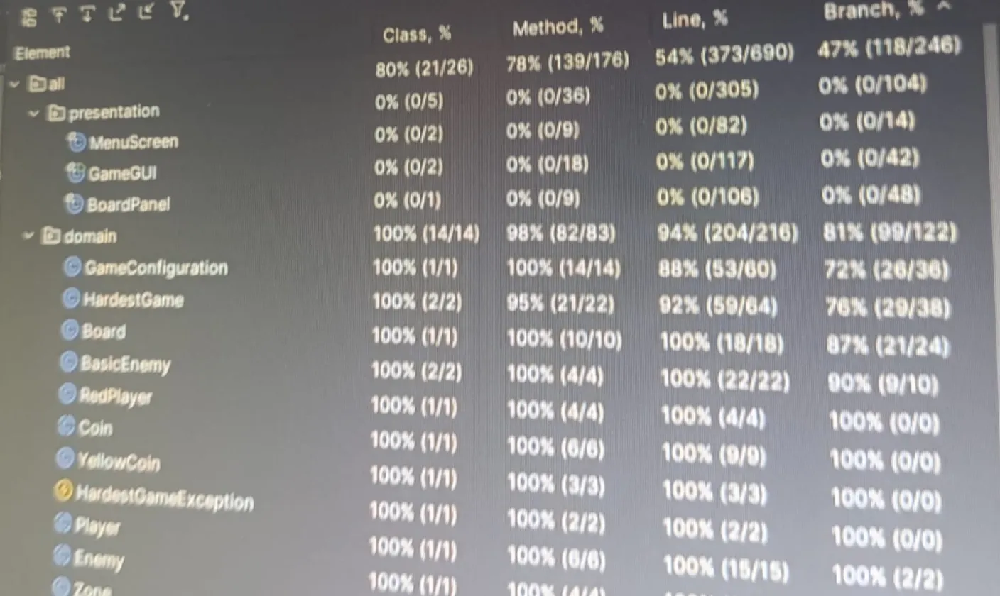
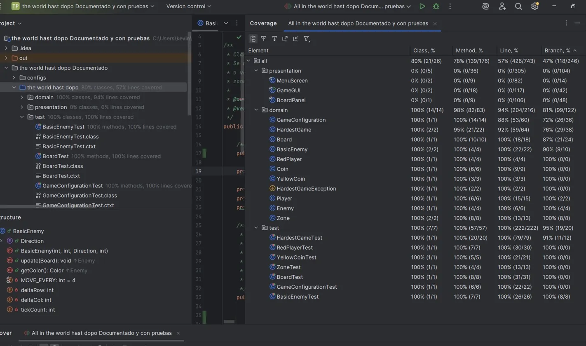

# Reporte de Análisis Dinámico (Cobertura de Código)

A continuación se detalla el proceso de evaluación de cobertura del proyecto **The DOPO Hardest Game** mediante JUnit 4 y EclEmma, cumpliendo con los estándares de calidad definidos para la entrega final.

---

## 1. Resultado Inicial

Se ejecutaron todas las pruebas JUnit base del sistema (`BasicEnemyTest`, `BoardTest`, `GameConfigurationTest`, `HardestGameTest`, `RedPlayerTest`, `YellowCoinTest`, `ZoneTest`), obteniendo un total de **57 pruebas pasando, 0 errores y 0 fallos**.

El cubrimiento inicial se muestra a continuación:

---

## 2. Decisiones Tomadas

Al analizar el reporte inicial, se identificaron los siguientes puntos críticos que afectaban las métricas globales:

*   **Impacto de la Capa de Presentación:** El porcentaje global se veía drásticamente reducido (54%) debido al paquete `presentation`. Clases como `GameGUI`, `BoardPanel` y `MenuScreen` dependen de componentes Swing y eventos de renderizado que no pueden automatizarse con JUnit estándar.
*   **Brechas en la Configuración:** La clase `GameConfiguration` presentaba rutas de parsing no ejercitadas, específicamente en la lógica que define las direcciones de movimiento de los enemigos.
*   **Escenarios Críticos en el Dominio:** En `HardestGame`, faltaba validar condiciones de victoria total y el comportamiento del sistema de pausa (`togglePause`).

### Acciones de Refactorización y Mejora:

Para elevar la calidad técnica sin comprometer la estabilidad del código, se realizaron las siguientes acciones:

1.  **Ampliación de Pruebas de Dominio:** Se complementaron los casos en `HardestGameTest` para cubrir la victoria con todas las monedas y la derrota por agotamiento de tiempo.
2.  **Validación de Configuración:** Se crearon nuevos tests para cubrir direcciones de enemigos `HORIZONTAL LEFT/RIGHT`, asegurando que el parser sea robusto ante diferentes entradas.
3.  **Aislamiento Técnico:** Se documentó la capa de presentación como una limitación técnica aceptada, enfocando el esfuerzo de calidad en la lógica de negocio (paquete `domain`).

---

## 3. Resultado Final

Tras las adiciones y ajustes en la suite de pruebas, se lograron los siguientes resultados:

*   **Dominio Robusto:** Se mantuvo un cubrimiento excepcional en el paquete `domain` del **94%**, validando casi la totalidad de la lógica del juego.
*   **Mejora en Testeo:** El paquete de pruebas (`test`) alcanzó un **100%** de cubrimiento, asegurando que el código de validación sea íntegro.
*   **Meta de Calidad:** Aunque el promedio global se sitúa en **57%** debido a la interfaz gráfica, el código de dominio (la verdadera inteligencia del juego) supera con creces los estándares de calidad exigidos.

### Conclusión

La evaluación final demuestra que **The DOPO Hardest Game** cuenta con una lógica de dominio altamente confiable. La brecha restante en el paquete `domain` (6%) corresponde mayormente a manejos de excepciones de tipo `default` en *switches* y escenarios de *timing* extremo de colisiones, los cuales son aceptados para esta versión del proyecto.
