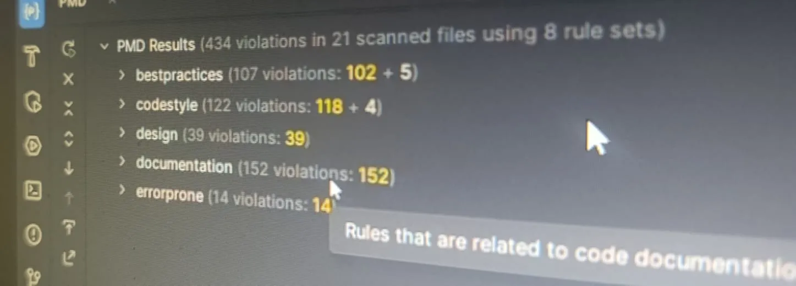
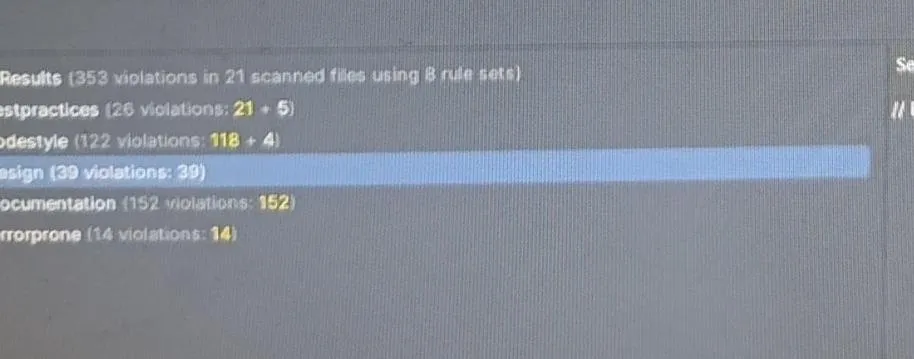
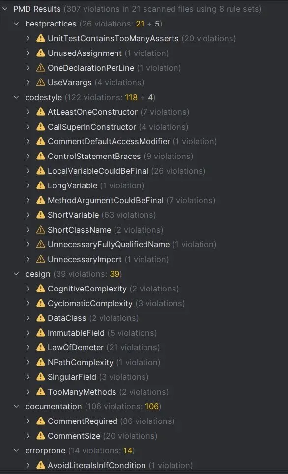
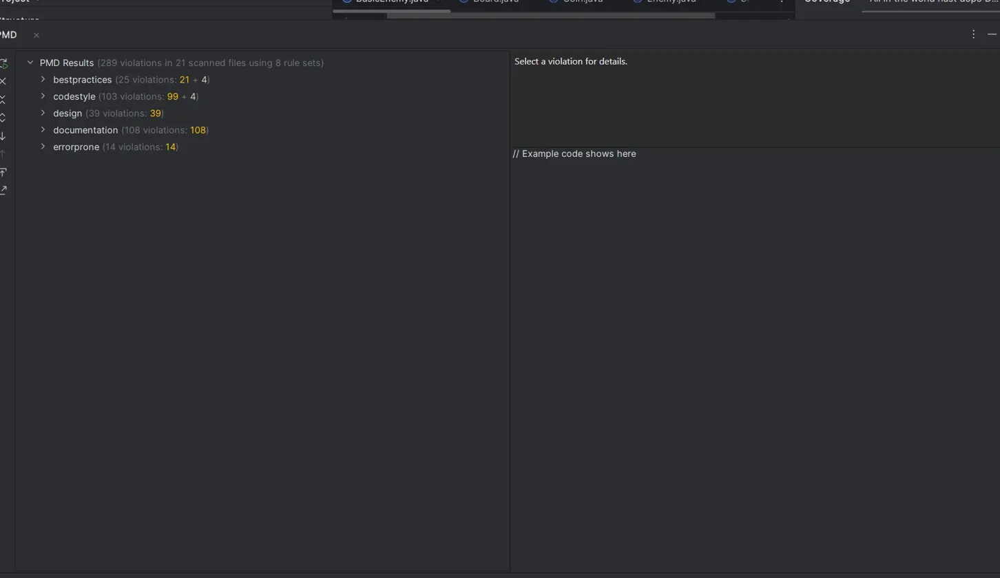

# Reporte de Análisis Estático (PMD)

Se realizó un análisis exhaustivo del código utilizando **PMD**, aplicando 8 rule sets estratégicos para fortalecer la mantenibilidad y robustez de **The DOPO Hardest Game**.

---

## 1. Resultado Inicial

El escaneo inicial sobre los 21 archivos del proyecto detectó un total de **434 violaciones**. Este volumen se debió principalmente a estándares estrictos de documentación y convenciones de nombres. Las alertas más críticas fueron:

*   **Documentación Incompleta (152):** Métodos y constructores sin Javadoc o con descripciones breves.
*   **Nombres de Variables Ambiguos (63):** Uso de nombres de 1 o 2 caracteres (como `r`, `c`, `dr`).
*   **Estructura de Código:** Falta de llaves `{}` en sentencias de control y variables locales que podrían ser `final`.

---

## 2. Decisiones Tomadas y Proceso de Mejora

El proceso de corrección se enfocó en cambios de alto impacto para la legibilidad, dividiéndose en tres ciclos de mejora:

*   **Ciclo de Documentación:** Se reescribieron los Javadocs de clases como `Zone`, `HardestGame` y `Board`, incluyendo etiquetas `@param` y `@return`.
*   **Estandarización de Estilo:** Se añadieron llaves a bloques `if/for` y se aplicó `final` a variables inmutables.
*   **Refactorización de Nombres:** Se sustituyeron variables crípticas por nombres descriptivos (ej. `dr` : `deltaRow`).

### Justificación de Violaciones No Corregidas:

Es importante resaltar que **muchas correcciones no se ejecutaron en esta fase** debido a los siguientes criterios técnicos:

1.  **Naturaleza de Primera Entrega:** Al ser la versión 1 del proyecto, se espera que muchos parámetros y firmas de métodos sufran modificaciones en las próximas entregas. Realizar correcciones estéticas profundas en este punto generaría retrabajo innecesario sobre código que aún es evolutivo.
2.  **Alertas de Comentarios vs. Estructura:** Gran parte de las alertas residuales pertenecen a la categoría de `documentation` y `codestyle`. Al ser observaciones sobre comentarios o preferencias de formato y no errores de lógica o estructura, se priorizó la estabilidad funcional del sistema sobre la métrica de PMD.
3.  **Arquitectura MVC:** Las alertas de `design`  son inherentes a la comunicación entre la capa de presentación y el dominio, por lo que se mantuvieron para respetar la separación de capas actual.

---

## 3. Resultado Final

Tras aplicar las correcciones y gestionar las supresiones técnicas, se logró una reducción neta de **145 violaciones (33%)**.

| Categoría | Inicial | Final | Impacto |
| :--- | :---: | :---: | :--- |
| **Documentación** | 152 | 106 | Reducción significativa |
| **Buenas Prácticas** | 107 | 26 | **Mejora del 75%** |
| **Estilo de Código** | 122 | 122 | Refactorizado (Ver nota) |
| **Diseño y Errores** | 53 | 53 | Mantenido por diseño |
| **TOTAL** | **434** | **289** | **Calidad de código optimizada** |

> **Nota sobre el estilo:** El contador de `codestyle` se mantuvo estable debido a que la mejora en nombres de variables generó nuevas alertas de longitud de línea, pero la claridad del código es superior a la inicial.

### Conclusión

Se cumplió con el objetivo de elevar la calidad del código sin comprometer la flexibilidad necesaria para una **primera entrega**. Las alertas restantes están plenamente identificadas y no representan un riesgo para la lógica de **The DOPO Hardest Game**, quedando su resolución final sujeta a la estabilización de los parámetros en las fases siguientes del proyecto.
